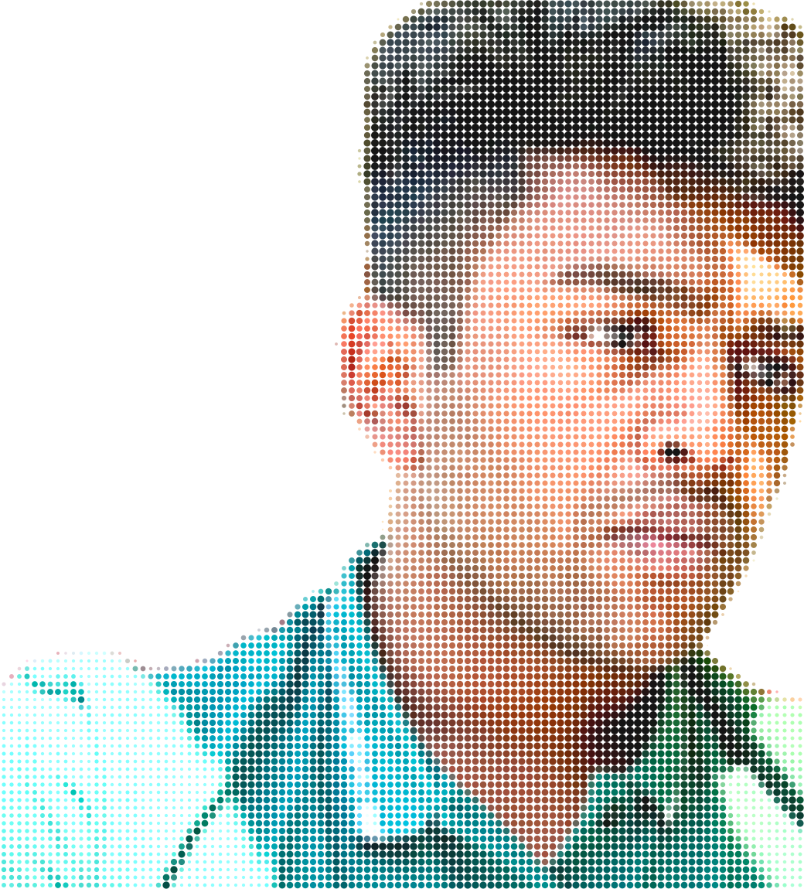
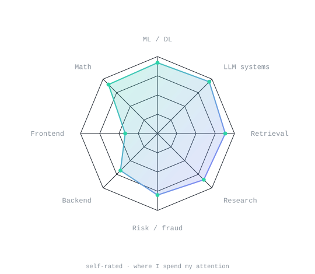
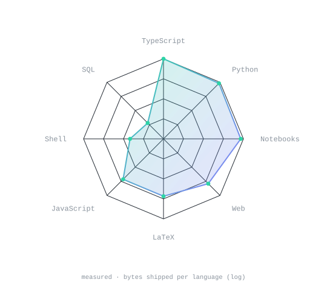
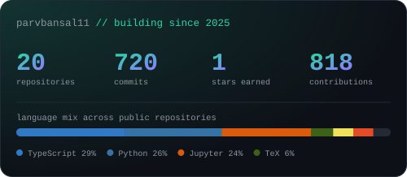
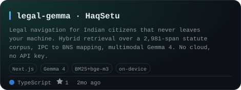
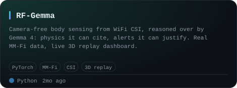
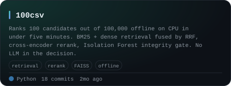
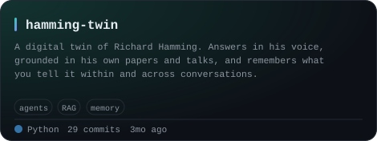
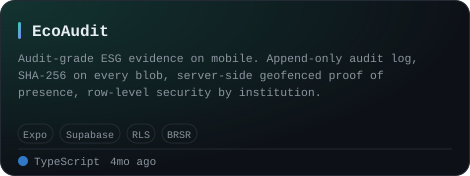
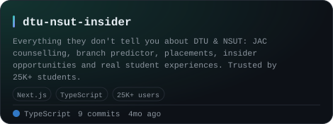

<div align="center">

<!-- PORTRAIT - dot matrix, colour, transparent background, so one file serves
     both themes. The dots sweep in on a diagonal via CSS keyframes. Vision mattes
     the person; scripts/matte.py adds back the laptop it will not call foreground:
       swift scripts/cutout.swift assets/source.jpg assets/me.png
       python scripts/matte.py assets/source.jpg assets/me.png -o assets/me-full.png \
         --keep-right-of 1185,0,1052,940 --drop-above 1435,0,1660,110 --drop-bright
       python scripts/dotify.py assets/me-full.png -o assets/portrait --cols 140 \
         --sweep --crop 0,0,0.82,1.0 --detail 0.16 --gamma 0.95 --gain 1.18 --lift 0.07 -->


<br>

<!-- NAME / TAGLINE - animated typing -->
<a href="https://parvbansal.vercel.app">
  
</a>

<br>

<!-- SOCIALS -->
<a href="https://www.linkedin.com/in/parvv"></a>
<a href="mailto:parvbansal0011@gmail.com"></a>
<a href="https://parvbansal.vercel.app"></a>
<a href="https://github.com/parvbansal11?tab=repositories"></a>

<br>


</div>

---

## `~/` whoami

```console
$ cat about.txt
```

I'm **Parv Bansal**, reading Mathematics and Computing at **Delhi Technological University**.
I build machine-learning systems that hold up when you look closely at them: retrieval you can
trace, models you can interrogate, and results that survive being measured a second time.

- Currently building in **fraud detection** and **investing** - risk models, identity
  signals, and the plumbing that has to hold up underneath them
- Researching **multi-turn jailbreak robustness** and what quantization actually does to it
  → **[refusal-quant-multiturn](https://github.com/parvbansal11/refusal-quant-multiturn)**
- Into **local-first AI**: if it needs an API key to demo, I'm less interested
- Fun fact: **my favourite result last year was a negative one.** It was also the most useful

<br>

<div align="center">

## `~/` toolbox


</div>

---

<div align="center">

## `~/` skill radar

<table>
<tr>
<td width="50%" align="center" valign="middle">

<!-- Self-rated - edit assets/skills.json, the workflow redraws it -->
<picture>
  <source media="(prefers-color-scheme: dark)"  srcset="assets/radar-dark.svg">
  <source media="(prefers-color-scheme: light)" srcset="assets/radar-light.svg">
  
</picture>

</td>
<td width="50%" align="center" valign="middle">

<!-- Measured - real language byte counts across every public repo -->
<picture>
  <source media="(prefers-color-scheme: dark)"  srcset="assets/radar-langs-dark.svg">
  <source media="(prefers-color-scheme: light)" srcset="assets/radar-langs-light.svg">
  
</picture>

</td>
</tr>
</table>

<sub>left: what I claim &nbsp;·&nbsp; right: what the commit history says. Both are redrawn every six hours.</sub>

</div>

---

<div align="center">

## `~/` contribution calendar

<!-- 3D isometric calendar, regenerated every 6h by .github/workflows/metrics.yml -->


<br><br>

<!-- Snake eats the contribution graph - .github/workflows/snake.yml -->
<picture>
  <source media="(prefers-color-scheme: dark)"  srcset="https://raw.githubusercontent.com/parvbansal11/parvbansal11/output/snake-dark.svg">
  <source media="(prefers-color-scheme: light)" srcset="https://raw.githubusercontent.com/parvbansal11/parvbansal11/output/snake.svg">
  
</picture>

</div>

---

<div align="center">

## `~/` the numbers

<!-- Drawn by scripts/cards.py into this repo. Deliberately NOT github-readme-stats
     or streak-stats: those are shared public instances that go down and take the
     whole section with them. -->
<picture>
  <source media="(prefers-color-scheme: dark)"  srcset="assets/card-stats-dark.svg">
  <source media="(prefers-color-scheme: light)" srcset="assets/card-stats-light.svg">
  
</picture>

<br>


<br><br>


</div>

---

<div align="center">

## `~/` selected work

<!-- Cards generated by scripts/cards.py from assets/projects.json.
     Language, commits and freshness are pulled live from the API on every run. -->
<table>
<tr>
<td width="50%">
  <a href="https://github.com/parvbansal11/legal-gemma">
    <picture>
      <source media="(prefers-color-scheme: dark)"  srcset="assets/card-legal-gemma-dark.svg">
      <source media="(prefers-color-scheme: light)" srcset="assets/card-legal-gemma-light.svg">
      
    </picture>
  </a>
</td>
<td width="50%">
  <a href="https://github.com/parvbansal11/RF-Gemma">
    <picture>
      <source media="(prefers-color-scheme: dark)"  srcset="assets/card-RF-Gemma-dark.svg">
      <source media="(prefers-color-scheme: light)" srcset="assets/card-RF-Gemma-light.svg">
      
    </picture>
  </a>
</td>
</tr>
<tr>
<td width="50%">
  <a href="https://github.com/parvbansal11/100csv">
    <picture>
      <source media="(prefers-color-scheme: dark)"  srcset="assets/card-100csv-dark.svg">
      <source media="(prefers-color-scheme: light)" srcset="assets/card-100csv-light.svg">
      
    </picture>
  </a>
</td>
<td width="50%">
  <a href="https://github.com/parvbansal11/hamming-twin">
    <picture>
      <source media="(prefers-color-scheme: dark)"  srcset="assets/card-hamming-twin-dark.svg">
      <source media="(prefers-color-scheme: light)" srcset="assets/card-hamming-twin-light.svg">
      
    </picture>
  </a>
</td>
</tr>
<tr>
<td width="50%">
  <a href="https://github.com/parvbansal11/EcoAuditAPP">
    <picture>
      <source media="(prefers-color-scheme: dark)"  srcset="assets/card-EcoAuditAPP-dark.svg">
      <source media="(prefers-color-scheme: light)" srcset="assets/card-EcoAuditAPP-light.svg">
      
    </picture>
  </a>
</td>
<td width="50%">
  <a href="https://github.com/parvbansal11/dtu-nsut-insider">
    <picture>
      <source media="(prefers-color-scheme: dark)"  srcset="assets/card-dtu-nsut-insider-dark.svg">
      <source media="(prefers-color-scheme: light)" srcset="assets/card-dtu-nsut-insider-light.svg">
      
    </picture>
  </a>
</td>
</tr>
</table>

</div>

---

## `~/` open questions I'm working on

```console
$ cat research.md
```

| question | where it lives |
|---|---|
| Does quantization change the multi-turn suppression trajectory of a model's refusal direction? | **[refusal-quant-multiturn](https://github.com/parvbansal11/refusal-quant-multiturn)** |
| Can two inference-time defenses hold against a Crescendo escalation on a 3B model? | **[crescendo-defense-llm](https://github.com/parvbansal11/crescendo-defense-llm)** |
| How much of a person's reasoning survives being reconstructed from their own writing? | **[hamming-twin](https://github.com/parvbansal11/hamming-twin)** |
| Can WiFi CSI carry enough signal for a language model to reason about a body in a room? | **[RF-Gemma](https://github.com/parvbansal11/RF-Gemma)** |

<br>

<div align="center">

## `~/` how this page is built

<sub>

Nothing here is fetched from a shared card service at read time. The portrait is a dot matrix
rendered from a photo by `scripts/dotify.py`; the radars, the stat card and every project card
are drawn by `scripts/radar.py` and `scripts/cards.py` and committed as static SVG. A workflow
redraws them every six hours, so the numbers stay live and the page never breaks because
someone else's server went down.

`scripts/` · `assets/projects.json` · `.github/workflows/`

</sub>

<br>

<sub>`01100010 01110101 01101001 01101100 01100100 00100000 01110100 01101000 01100101 00100000 01101000 01100001 01110010 01100100 00100000 01110000 01100001 01110010 01110100`</sub>

</div>
